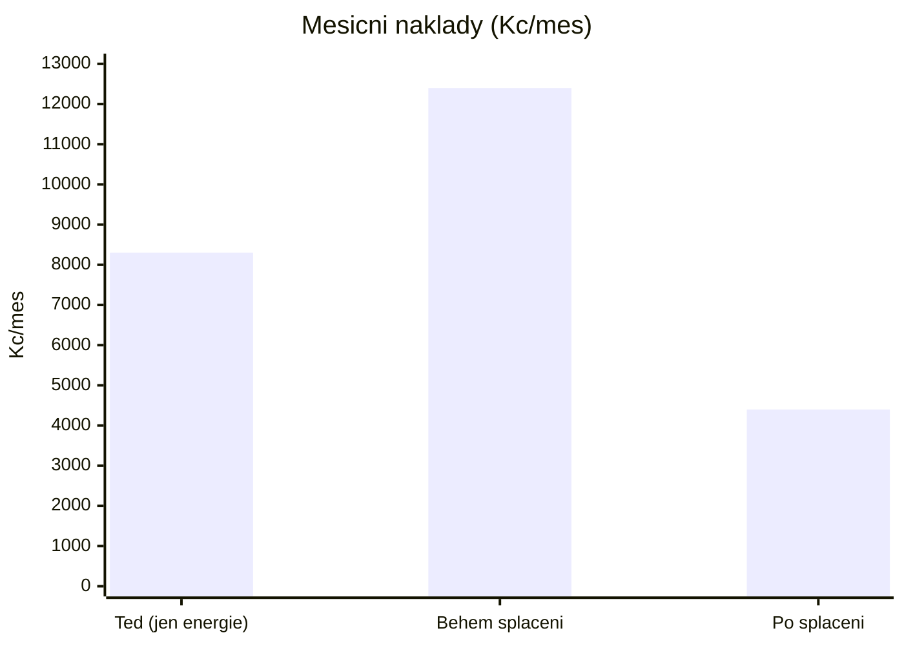

# Měsíční platby: teď vs. po rekonstrukci

> **Vše orientační.** Jednotkové ceny energií jsou **skutečné** (z mých faktur),
> úspory a splátka jsou odhad. Odvození čísel je v
> [Rešerši, sekce 0.6](../reserse-nzu-2026.html).
> Splátka platí pro **bezúročný úvěr ~1,44 mil. Kč na 15 let** (moje větev — viz
> [Financování](financovani.html)).

## Hlavní srovnání — tři fáze

| Měsíčně (Kč) | **Teď** (před) | **Během splácení** (15 let) | **Po splacení** |
|---|---:|---:|---:|
| Elektřina | ~3 900 | ~1 400 | ~1 400 |
| Plyn (vytápění + TV + vaření) | ~4 400 | ~3 000 | ~3 000 |
| **Energie celkem** | **~8 300** | **~4 400** | **~4 400** |
| Splátka úvěru (bezúročně) | — | ~8 000 | — |
| **Celkem měsíčně** | **~8 300** | **~12 400** | **~4 400** |

- **Teď** platím jen energie: **~8 300 Kč/měs** (~100 tis. Kč/rok).
- **Během splácení** platím nižší energie **+ splátku**: **~12 400 Kč/měs**. Je to
  o **~4 100 Kč/měs víc** než dnes — rekonstrukci **splácím**, sama se „nezaplatí".
- **Po splacení** (po ~15 letech) zůstává jen **~4 400 Kč/měs** za energie →
  čistá úspora **~3 900 Kč/měs** (~47 tis. Kč/rok) oproti dnešku, navíc vyšší
  komfort a hodnota domu.

## Přesně na tvé otázky

| Otázka | Částka (orientačně) |
|---|---:|
| Kolik platím měsíčně **za energie teď** | **~8 300 Kč/měs** |
| Kolik budu platit **za energie po rekonstrukci** | **~4 400 Kč/měs** |
| Kolik bude **měsíční splátka úvěru** | **~8 000 Kč/měs** |
| Kolik budu platit **energie + splátka** (během splácení) | **~12 400 Kč/měs** |
| Kolik platím **za energie předtím** (= dnes) | **~8 300 Kč/měs** |

## Odkud úspory plynou

| Opatření | Úspora (Kč/měs) | Proč |
|---|---:|---|
| **FVE 8 kWp + baterie** → elektřina | ~2 500 | drahá elektřina (~7,96 Kč/kWh), vlastní spotřeba ~4 000 kWh/rok |
| **Zateplení fasády + okna** → plyn | ~1 400 | ~35 % úspora vytápění; střecha už zateplená, plyn levný (~1,84 Kč/kWh) |
| **Úspora energie celkem** | **~3 900** | ≈ 47 % dnešních nákladů na energie |

> **Pozn.:** Elektřina je u mě drahá → **FVE je ekonomicky nejsilnější** opatření.
> Plyn je levný → úspora ze zateplení je v Kč skromnější (poroste s budoucí cenou plynu).

## Graf — měsíční zatížení (Kč/měs)

## Bonus: kdybych pořídil i elektromobil

Splátka (~96 tis. Kč/rok) je vyšší než energetická úspora (~47 tis. Kč/rok) —
ale **úspora za palivo EV vs. benzín** (~45–50 tis. Kč/rok) rozdíl skoro vyrovná,
takže cash-flow během splácení je zhruba **neutrální**. Detail v
[Rešerši, bod 12](../reserse-nzu-2026.html).

## Co tím není řečeno

- Čísla jsou **orientační**; finální splátku určí **banka** (bonita, sazba, výše úvěru)
  a energie se mění s cenou komodit.
- Splátka předpokládá **15 let** (úvěr nad 500 tis.). Splatnost 25 let se mě
  pravděpodobně netýká — viz [Rešerše, bod 2](../reserse-nzu-2026.html).
