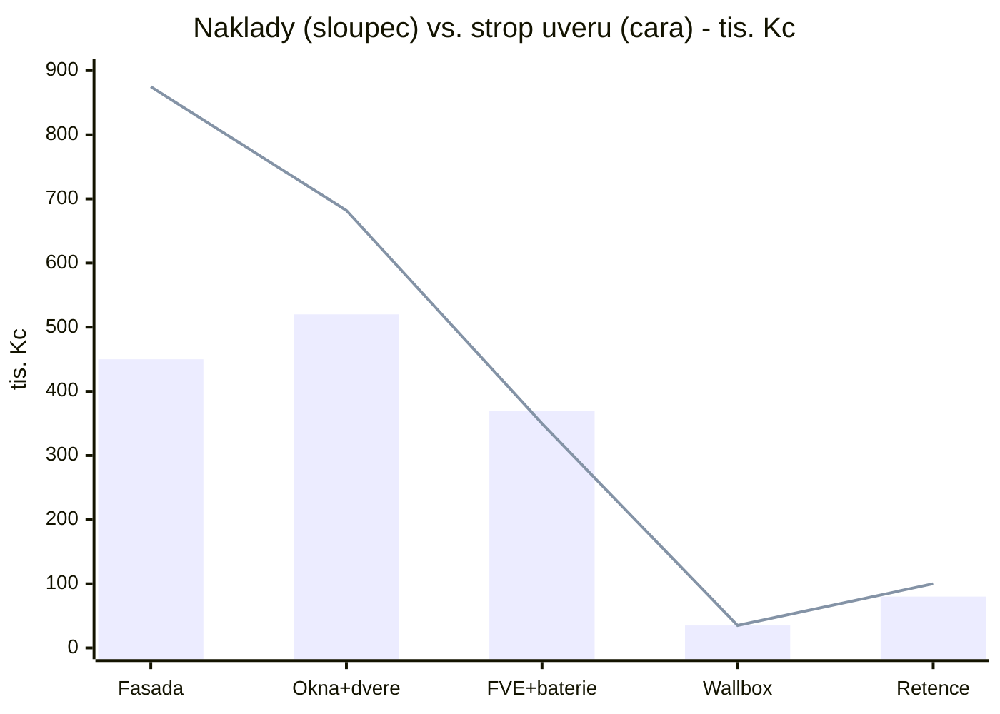
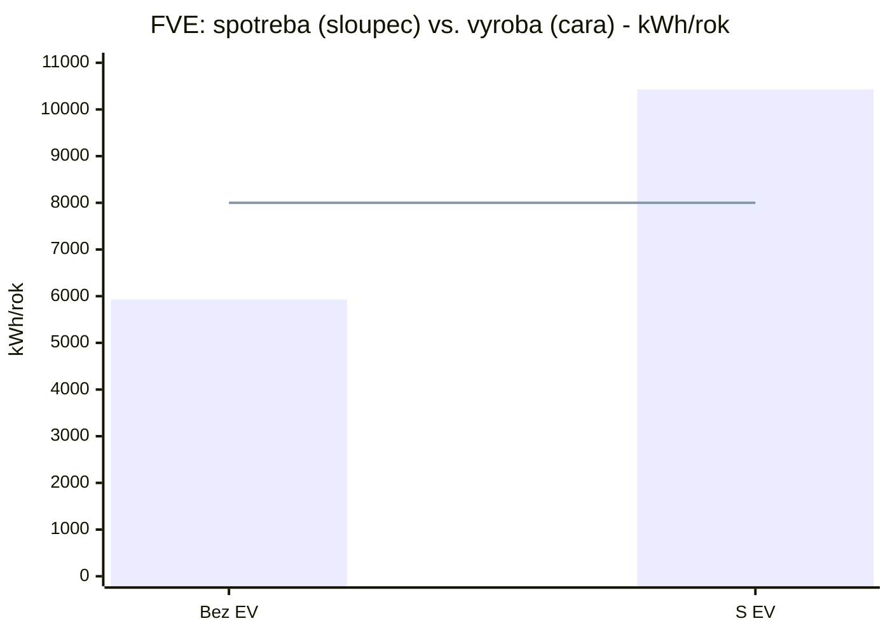
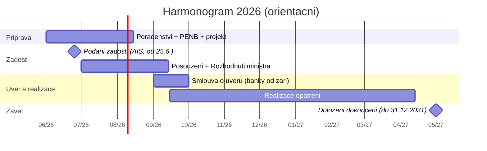
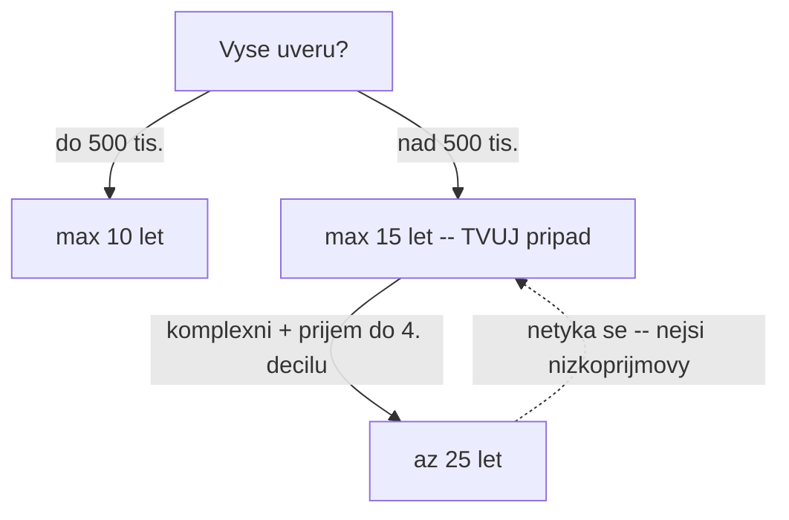
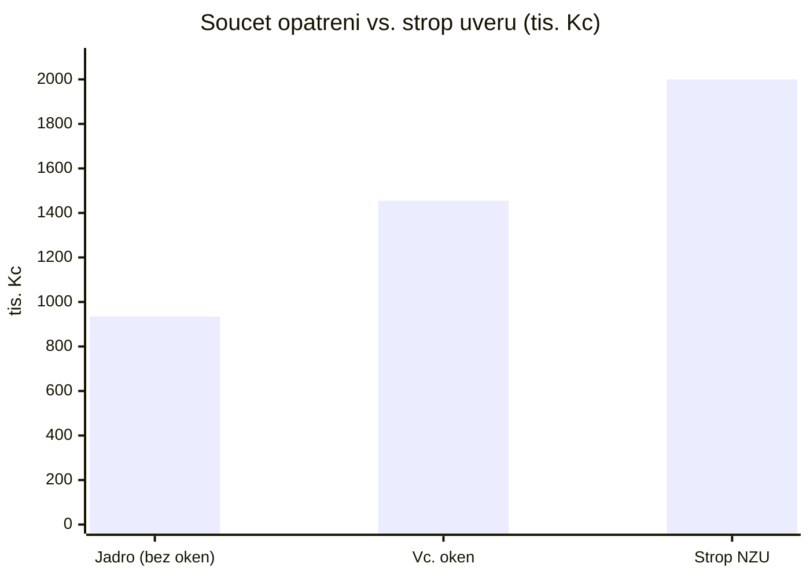

# Rešerše: Nová zelená úsporám 2026+ a NZÚ Light 2026 pro konkrétní dům

> **Datum zpracování:** 31. 5. 2026
> **Stav podmínek:** Závazné pokyny pro **bezúročný úvěr – rodinné domy** jsou platné **od 28. 5. 2026** (primární zdroj níže). Příjem žádostí startuje **25. 6. 2026**, banky nabízejí úvěr **od září 2026**.
>
> **Jak číst tento dokument:** Všechny ceny a propočty jsou **orientační odhad**. U sazeb a podmínek programu je uveden zdroj. **Primární zdroj** je dokument *Závazné pokyny pro žadatele a příjemce podpory v podprogramu NZÚ – RODINNÉ DOMY, platné od 28. 5. 2026* (dále „Závazné pokyny RD"). Komerční weby jsou označeny a slouží jen jako doplněk.

## Klíčové sdělení hned na úvod

1. **Jako nenízkopříjmová domácnost spadáte do větve „bezúročný úvěr".** Přímé dotace v NZÚ 2026 zůstávají **pouze** pro zranitelné/nízkopříjmové domácnosti (NZÚ Light). Pro vás je tedy ve většině propočtů scénář „přímá dotace" = **nemáte na ni nárok**.
2. **Bezúročný úvěr = stát hradí úroky, vy splácíte jen jistinu.** Není to dotace „na ruku". Úvěr navíc **nesmí přesáhnout doložené náklady** opatření.
3. **Splatnost „až 25 let" se vás pravděpodobně netýká.** 25 let je vyhrazeno jen pro příjmy do 4. decilu (viz bod 2). Pro vás reálně **max. 15 let** (úvěr nad 500 000 Kč). To je důležitá korekce oproti tomu, co píší média.
4. **Můžete už teď** oslovovat projektanty, energetického specialistu a dodavatele a nechat si zpracovat podklady. U **plateb za realizaci** ale pozor na návaznost na úvěr (viz bod 7).
5. **Okres Kladno NENÍ znevýhodněný region** (ten bonus se týká jen Karlovarského, Ústeckého a Moravskoslezského kraje).

---

## 0) Můj případ — podklady, grafy a souhrnný propočet

> Tato sekce shrnuje **jen to, co se týká mého domu**. Všechny ceny/propočty jsou **orientační odhad**; jednotkové ceny energií jsou **skutečné** (z mých faktur). Hodnoty závisí na doplnění **plochy střechy** a finálních nabídkách.

### 0.1 Vstupní údaje (podklady pro přepočet)

**Dům:** RD, kolaudace **2009** (splňuje „před 1. 7. 2013"), Středočeský kraj, obec u Dřetovic (okr. Kladno). Konstrukce **Porotherm bez zateplení**. **Nenízkopříjmová** domácnost → větev **bezúročný úvěr**.

**Plánovaná opatření a rozsah:**

| Opatření | Rozsah | Sazba (max. úvěr) | Strop |
|---|---|---|---|
| Zateplení fasády | **250 m²** | 3 500 Kč/m² | — |
| Zateplení střechy | **_doplnit m²_** | 3 500 Kč/m² | — |
| Okna (volitelné) | **44,69 m²** (19 ks) | 12 000 Kč/m² | — |
| Dveře (volitelné) | **12,11 m²** (4 ks) | 12 000 Kč/m² | — |
| Otvory celkem | **56,81 m²** (23) | 12 000 Kč/m² | — |
| FVE | **~8 kWp** (střecha ~40 m²) | 25 000 Kč/kWp | 400 000 Kč (vč. baterie) |
| Baterie | **~10 kWh** | 15 000 Kč/kWh | (v rámci 400 000) |
| Wallbox + EV | nájezd **25 000 km/rok** | způsobilý výdaj obl. C | — |
| Retenční nádrž z jímky (D.2) | přestavba jímky | — | 100 000 Kč |

**Spotřeba a ceny energií (skutečné z faktur):**

| Energie | Období | Spotřeba | Zaplaceno (vč. DPH) | **Jednotková cena** |
|---|---|---|---|---|
| Elektřina | 25. 6. 2024 – 26. 6. 2025 (rok) | 5 931 kWh (VT 4 435 / NT 1 496) | 47 185,35 Kč | **~7,96 Kč/kWh** |
| Plyn | 16. 12. 2024 – 3. 9. 2025 (261 dní) | 24 050,35 kWh (2 201,75 m³) | 44 284,76 Kč | **~1,84 Kč/kWh** |

- **Roční spotřeba plynu (odhad):** ~30 MWh (lineární přepočet 261 dní = ~33,6 MWh **nadhodnocuje**, období je zimou vážené). → **roční náklad na plyn ~52 000–58 000 Kč** (orientačně).
- **Roční náklad na energie (základ pro % úsporu):** elektřina 47 185 Kč + plyn ~55 000 Kč ≈ **~100 000 Kč/rok**.
- **Auto:** 25 000 km/rok → EV ~4 000–5 000 kWh/rok; benzín ~66 000 Kč/rok (7 l/100 km × 38 Kč/l).

Detailní rozpis zaměřených otvorů (klikni)

| Patro | Otvor | m² | | Patro | Otvor | m² |
|---|---|---|---|---|---|---|
| 1.NP | Ložnice – balkonové | 3,275 | | 0.NP | Garáž – okno A | 1,978 |
| 1.NP | Šatna – okno A | 1,566 | | 0.NP | Předsíň – okno B | 0,716 |
| 1.NP | Koupelna A – okno B | 1,495 | | 0.NP | Koupelna B – okno C | 1,879 |
| 1.NP | Pracovna – okno C | 1,483 | | 0.NP | Kuchyň – okno D | 1,924 |
| 1.NP | Pracovna – okno D | 1,571 | | 0.NP | Kuchyň – okno E | 4,195 |
| 1.NP | Eli pokoj – balkonové dveře | 3,200 | | 0.NP | Kuchyň – okno F | 4,195 |
| 1.NP | Eli pokoj – okno E | 3,637 | | 0.NP | Kuchyň – okno G | 2,833 |
| 1.NP | Tom pokoj – okno F | 2,387 | | 0.NP | Kuchyň – okno H | 2,833 |
| 1.NP | Tom pokoj – okno G | 1,785 | | **Dveře** | Garáž – dveře A | 2,129 |
| 1.NP | Pokoj hosté – okno H | 2,269 | | **Dveře** | Předsíň – hlavní dveře B | 4,252 |
| 1.NP | Pokoj hosté – šatna okno I | 1,473 | | **Dveře** | Kuchyň – dveře C | 2,289 |
| | | | | **Dveře** | Kuchyň – dvoukřídlé D | 3,444 |

Okna 44,69 m² (19 ks) · Dveře 12,11 m² (4 ks) · **Celkem 56,81 m² (23 otvorů)**. Pozn.: garážové otvory mohou být mimo vytápěnou obálku → nárok ověřit; garážová vrata jsou z podpory vyloučena.

### 0.2 Graf — orientační náklady vs. maximální úvěr (tis. Kč)

> Sloupec = orientační cena opatření, čára = strop úvěru (sazba × rozsah). Kde čára ≥ sloupec, úvěr pokryje plnou cenu.

### 0.3 Graf — energetická bilance FVE (kWh/rok)

> Sloupec = spotřeba domu, čára = výroba FVE (~8 000 kWh). Bez EV je přebytek, s EV deficit → důraz na vlastní spotřebu a nabíjení přes den.

### 0.4 Harmonogram 2026

### 0.5 Splatnost a strop úvěru

### 0.6 Souhrnný propočet: investice → splátka → úspora → % úspory

> Vše orientační. Jednotkové ceny energií jsou skutečné (faktury). Úspora vytápění předpokládá **komplexní** zateplení (fasáda + okna + střecha) ~45 %; bez střechy je nižší. **Doplň plochu střechy** pro upřesnění.

| Krok | Hodnota (orientačně) |
|---|---|
| **Investice** celkem (fasáda + okna + FVE+baterie + wallbox + retence, **bez střechy**) | **~1 455 000 Kč** |
| Pokryto bezúročným úvěrem | ~1 435 000 Kč |
| Doplatek z vlastního (hl. část FVE nad strop) | ~20 000 Kč |
| Vejde se do stropu 2 mil. Kč? | **Ano** (rezerva ~545 tis. i na střechu) |
| **Měsíční splátka** (15 let, bezúročně) | **~8 000 Kč/měs** |
| Ušetřeno na úrocích vs. běžný úvěr 5,5 % p.a. | **~650 000 Kč** za dobu splácení |
| Roční úspora **vytápění** (~45 % z plynu, plyn 1,84 Kč/kWh) | ~21 000 Kč/rok |
| Roční úspora **elektřiny** (vlastní spotřeba FVE ~4 000 kWh × 7,96 Kč) | ~30 000 Kč/rok |
| **Roční úspora energie celkem** | **~51 000 Kč/rok** |
| Současné roční náklady energie (plyn + elektřina) | ~100 000 Kč/rok |
| **➡ Úspora ≈ 45–55 % ročních nákladů na energie** | **~50 %** |
| (Bonus) úspora paliva **EV vs. benzín** | ~45 000–50 000 Kč/rok |

**Cash-flow poctivě:** během splácení je **splátka (~96 000 Kč/rok) vyšší než energetická úspora (~51 000 Kč/rok)** — renovaci splácíš, neplatí se „sama". Pokud ale pořídíš i **EV**, úspora za palivo (~48 000 Kč/rok) téměř vyrovná rozdíl a cash-flow je zhruba neutrální. **Po splacení** zůstává čistá úspora ~51 000 Kč/rok (+ EV) + vyšší komfort a hodnota nemovitosti. Elektřina je u tebe drahá (7,96 Kč/kWh) → **FVE je ekonomicky nejsilnější opatření**; plyn je levný (1,84 Kč/kWh) → úspora ze zateplení je v Kč skromnější (ale roste s plochou střechy a budoucí cenou plynu).

---

## 1) Způsobilost — do které větve spadáte

V roce 2026 existují fakticky **dvě živé větve** pro rodinné domy:

| Větev | Forma podpory | Pro koho | Vy? |
|---|---|---|---|
| **NZÚ Light** | **Přímá dotace** | Zranitelné/nízkopříjmové domácnosti | **NE** |
| **NZÚ bezúročný úvěr (RD)** | Kompenzace úroků u zvýhodněného úvěru | Ostatní vlastníci RD | **ANO — vaše větev** |
| ~~„Standardní" NZÚ s přímou dotací pro všechny~~ | ~~Přímá dotace na opatření~~ | — | **UKONČENO pro nové žadatele** |

**NZÚ Light 2026 — kdo má nárok** (zdroj: [novazelenausporam.cz/nzu-light](https://novazelenausporam.cz/nzu-light-zranitelne-domacnosti/)):
- domácnosti s velmi nízkými příjmy (do **3. příjmového decilu**) v nezatepleném domě (třída E–G),
- starobní důchodci s příjmem do **5. decilu** v nezatepleném domě,
- domácnosti s členem v invalidním důchodu 3. stupně (do 5. decilu).
- Výše: až **250 000 Kč** na zateplení + až **150 000 Kč** na zdroj/OZE (= max **400 000 Kč**). Žádosti od **25. 6. 2026** přes AIS SFŽP ČR.
- **Vy podmínky Light nesplňujete** (uvádíte, že nejste nízkopříjmová domácnost a nemáte nárok na superdávku).

**Rozdíl tří pojmů:**
- **NZÚ Light** = *dotace* vyplacená přímo, jen pro zranitelné. Cílí na rychlou základní renovaci.
- **NZÚ bezúročný úvěr** = úvěr od banky/stavební spořitelny, jehož **úroky platí stát** (SFŽP). Vy splácíte jistinu. Pro všechny ostatní.
- **„Standardní NZÚ"** (model 2021–2025 s přímou dotací na každé opatření, vč. „Oprav dům po babičce") byl pro nové žadatele **ukončen** a nahrazen úvěrem. Na webu programu je veden jako „ukončená etapa".

> Zdroje: tiskové zprávy MŽP [„Finální podoba programu NZÚ"](https://mzp.gov.cz/cz/pro-media-a-verejnost/aktuality/archiv-tiskovych-zprav/finalni-podoba-programu-nova-zelena-usporam-je-tu-domacnosti-mohou-zacit-s-pripravou-zadosti) a [„Efektivní, udržitelná a lépe cílená"](https://mzp.gov.cz/cz/pro-media-a-verejnost/aktuality/archiv-tiskovych-zprav/efektivni-udrzitelna-a-lepe-cilena-nova); Závazné pokyny RD, kap. 2.

---

## 2) Bezúročný úvěr — konkrétní podmínky (z primárního zdroje)

Vše níže je z **Závazných pokynů RD, platných 28. 5. 2026**, kap. 2.3 (PDF: [novazelenausporam.cz/.../NZÚ-RD26+.pdf](https://novazelenausporam.cz/dokumenty/)).

| Parametr | Hodnota |
|---|---|
| Forma | Kompenzace úroků u zvýhodněného úvěru (banky / stavební spořitelny) |
| **Min. vypočtená výše úvěru pro podání žádosti** | **100 000 Kč** |
| **Max. celkem na nemovitost** | **2 000 000 Kč** (součet všech žádostí) |
| **Max. na dílčí opatření** | **750 000 Kč** |
| Jak se stanoví max. výše | Součet jednotkových částek za jednotlivá opatření (viz bod 3) |
| **Úvěr ≤ doložené přímé realizační výdaje** | Ano (kap. 2.4 h) — úvěr nemůže být vyšší než skutečné náklady |
| Smlouva s bankou | Nejpozději **do 12 měsíců** od Rozhodnutí ministra |
| Doba udržitelnosti | **5 let** od doložení realizace |

**Doba kompenzace úroků (= „splatnost bez úroků")** — kap. 2.3 k):
- **do 10 let** — úvěry **do 500 000 Kč** včetně,
- **do 15 let** — úvěry **nad 500 000 Kč**,
- **do 25 let** — **pouze** zajištěné úvěry, které splňují **všechny** podmínky současně:
  1. jde o **komplexní renovaci**,
  2. ekvivalizovaný čistý měsíční příjem domácnosti **nepřekročí 4. příjmový decil**,
  3. domácnost nevlastní podíly na více než jedné další nemovitosti k bydlení,
  4. trvalý pobyt + užívání k bydlení.

> **Pro vás:** „2 mil. Kč na komplexní renovaci" platí jako strop. **„Až 25 let" ale téměř jistě NE** — podmínka 4. decilu je příjmově omezující a vy nejste nízkopříjmová domácnost. Realisticky počítejte se **splatností do 15 let**. Příjmový decil ověříte oficiálním [výpočtovým nástrojem (xlsx)](https://novazelenausporam.cz/dokumenty/) na webu programu.

**Banky:** úvěr poskytují „spolupracující banky a stavební spořitelny", **od září 2026**. Konkrétní seznam zapojených institucí **k 31. 5. 2026 ještě nebyl oficiálně zveřejněn** — *nehádám jména*. Banka navíc posuzuje bonitu nezávisle a může úvěr zkrátit či zamítnout.

**Překlopení stávající hypotéky do úvěru?** V Závazných pokynech RD **není žádné ustanovení o refinancování / konsolidaci existující hypotéky** do bezúročného úvěru. Úvěr je vázán na **financování konkrétních podporovaných opatření**, ne na refinancování starých dluhů. Existující zástavy z hypotéky přitom **nevadí** (kap. 2.1). → **Pravděpodobně nelze** překlopit hypotéku; tuto možnost ber jako **nepotvrzenou** a ověř přímo u banky.

---

## 3) Co lze financovat z vašeho rozsahu — sazby a stropy

Jednotkové částky = **maximální výše úvěru** na jednotku (Závazné pokyny RD, kap. 3). Připomínka: úvěr nikdy nepřesáhne doložené náklady.

### Oblast A — Zateplení (kap. 3.1)
| Konstrukce | Max. úvěr (základní) | Památkové budovy |
|---|---|---|
| **Stěny vnější, střechy, podlahy nad venkovním prostorem, lehké pláště** | **3 500 Kč/m²** | 5 000 Kč/m² |
| Strop pod nevytápěnou půdou, ke nevytápěným prostorům | 2 000 Kč/m² | 2 000 Kč/m² |
| Konstrukce k zemině | 5 000 Kč/m² | 5 000 Kč/m² |
| **Výplně otvorů (okna, balkonové i vchodové dveře)** | **12 000 Kč/m²** | 18 000 Kč/m² |
| Stínicí technika (venkovní, pohyblivá) | 3 000 Kč/m² | 3 000 Kč/m² |

### Oblast C — Zdroje energie
- **C.3 Fotovoltaika:** **25 000 Kč/kWp** + **15 000 Kč/kWh** baterie (lithium). **Strop opatření 400 000 Kč.** Min. výkon 3 kWp. **Baterie je povinná** — min. kapacita (kWh) ≥ instalovaný výkon (kWp). **Dobíjecí stanice (wallbox) je způsobilý výdaj** v rámci oblasti C (kap. 7.3 b).
> *Škrtnuto (netýká se vás): C.1 výměna zdroje tepla, C.2 ohřev vody, C.4 řízené větrání/rekuperace, C.5 teplo z odpadní vody. Plynový kotel u komplexní renovace zůstat může (plyn není tuhé fosilní palivo); podmínku „alespoň jeden OZE" splní FVE.*

### Oblast D — Adaptační opatření (jen v kombinaci s A nebo C!)
- **D.2 Hospodaření s vodou** — **přesně se týká vaší jímky**:
  - **„Dešťová voda + WC"** (využití dešťové vody jako užitkové, popř. i pro zálivku): **max 100 000 Kč**.
  - **„Šedá voda"** (vyčištěná odpadní voda jako užitková, popř. zálivka): **max 150 000 Kč**.
  - **Klíčové:** Závazné pokyny (kap. 3.3.2.2 b) výslovně připouštějí **využít stávající vyčištěné a těsné podzemní jímky (např. žumpy) jako akumulační nádrž**. To je přesně váš záměr „přestavba jímky na retenční nádrž".
  - Min. objem nádrže na dešťovku: **2 m³**.
  - **Pozor 1:** Oblast D lze podpořit **jen v kombinaci** se zateplením (A) nebo zdroji (C). Vy ji budete kombinovat → OK.
  - **Pozor 2:** Podpora cílí na **užitkovou vodu** (splachování WC, úklid); samotná **zálivka** je jen „sekundární využití". Systém čistě na zálivku bez napojení do domu nemusí splnit podmínku. Ověřte s projektantem.

### Program „Dešťovka"
Samostatná „Dešťovka" je **integrována do NZÚ 2026** (oblast D.2). Na stejnou nemovitost **nelze** čerpat, pokud už byla Dešťovka vyplacena. Pro vás tedy platí výše uvedené sazby D.2 v rámci úvěru.

### Bonusy (kombinace / region / šetrné materiály) — DŮLEŽITÉ UPŘESNĚNÍ
- **V Závazných pokynech RD pro bezúročný úvěr žádné bonusy nejsou.** Maximální výše úvěru se stanoví výhradně součtem jednotkových částek za opatření.
- Bonusy zmiňované v tiskových zprávách MŽP (kombinace opatření **10 000 Kč** za kombinaci, max **90 000 Kč** pro RD; **šetrné materiály až 30 000 Kč**; **strukturálně znevýhodněný region +10 %**) se podle všeho vážou k **dotační složce / bytovým domům**, nikoli k úvěru pro RD. → Berte je jako **nepotvrzené pro vaši větev** a ověřte u poradce/SFŽP.
- **Region:** i kdyby bonus pro úvěr platil, **okres Kladno (Středočeský kraj) mezi znevýhodněné regiony nepatří** (jen Karlovarský, Ústecký, Moravskoslezský). Bonus za region tedy **nezískáte**.

> Zdroj bonusů: TZ MŽP [„Startuje nová etapa… bonus až 200 000 Kč"](https://mzp.gov.cz/cz/pro-media-a-verejnost/aktuality/archiv-tiskovych-zprav/startuje-nova-etapa-programu-nova-zelena).

---

## 4) Podpora na projekt a specialistu

| Položka | Kdo to dělá | Cena / podpora |
|---|---|---|
| **Energetické poradenství** (síť poradců SFŽP, od dubna 2026) | Certifikovaní poradci | **Bezplatné** |
| **Renovační pas NZÚ** | Energetický specialista (§10/1b zák. 406/2000) **nebo** autorizovaná osoba ČKAIT/architekt (zák. 360/1992) | Online aplikace v rámci poradenství — **bezplatně / nízká cena**; povinný pro **dílčí** opatření |
| **PENB** (průkaz energ. náročnosti) | Energetický specialista s oprávněním ke zpracování PENB | Orientačně od ~1 450 Kč, u RD spíš **3 000–8 000 Kč** (komerční odhad) |
| **Projektová dokumentace** + energetické hodnocení | Autorizovaný projektant / energetický specialista | Dle rozsahu (tis. až desítky tis. Kč) |
| **Odborný technický dozor** (povinný u komplexní renovace) | Autorizovaná osoba (ČKAIT/architekt), nezávislá na dodavateli | Dle rozsahu |

**Co je zdarma vs. co platíte:**
- **Zdarma:** energetické poradenství SFŽP + renovační pas (online aplikace).
- **Platíte:** PENB, projektová dokumentace, energetický posudek pro komplexní renovaci, odborný technický dozor.
- **Dobrá zpráva:** náklady na **odborný posudek, technický dozor, revize a zkoušky** jsou podle kap. 7.1 g) **způsobilým přímým realizačním výdajem → lze je financovat úvěrem**.

**Pro VÁŠ případ (komplexní renovace):** budete potřebovat **PENB + projektovou dokumentaci** (ne „jen" renovační pas — ten je primárně pro dílčí opatření). U komplexní renovace je navíc **povinný odborný technický dozor**.

**„Podpora na projektovou dokumentaci až 50 000 Kč"** — pozor na nedorozumění. Jde o **jednorázovou kompenzaci projektové přípravy** (RD až **50 000 Kč**, BD až 100 000 Kč), spuštěnou **25. 3. 2026**, určenou těm, kdo **uhradili přípravu mezi zářím 2025 a únorem 2026** a nestihli žádost v předchozí etapě. **Na váš nový projekt v roce 2026 se pravděpodobně nevztahuje** — ověřte na SFŽP.

> Zdroj: Závazné pokyny RD kap. 5 a 7.1; TZ MŽP (kompenzace projektové přípravy).

---

## 5) Kolik to stojí vs. kolik pokryje podpora (orientační přehled)

> Vše orientační. „Úvěr pokryje" = maximální výše úvěru (≤ skutečné náklady). Bezúročný úvěr ≠ dotace: částku **splatíte**, ale **bez úroků**.

| Opatření | Orientační cena | Max. úvěr (sazba × rozsah) | Doplatek nad rámec úvěru | Přímá dotace |
|---|---|---|---|---|
| Zateplení fasády 250 m² | 375 000–550 000 (EPS) / 460 000–710 000 (MW) | 250 × 3 500 = **875 000** | obvykle **0** (úvěr ≥ cena) | **nemáte nárok** |
| Okna 44,69 m² + dveře 12,11 m² | ~400 000–650 000 (plast) a více (hliník) | 56,81 × 12 000 = **681 720** | 0 u plastu; u hliníku možný | **nemáte nárok** |
| FVE 8 kWp + baterie 10 kWh | 320 000–420 000 | 8×25 000 + 10×15 000 = **350 000** (strop 400 000) | malý (desítky tis.) | **nemáte nárok** |
| Wallbox | 30 000–40 000 | způsobilý výdaj oblasti C* | dle nákladů | **nemáte nárok** |
| Retenční nádrž z jímky (D.2) | 50 000–150 000 | **100 000** (dešťovka+WC) | dle nákladů | **nemáte nárok** |

\* Wallbox nemá v pokynech RD vlastní jednotkovou sazbu ani samostatný strop — je veden jako způsobilý výdaj oblasti C (typicky navázaný na FVE). Jak přesně vstupuje do výpočtu max. úvěru, **není v dokumentu jednoznačné → ověřit**.

---

## 6) Postup krok za krokem (s daty 2026)

1. **Bezplatné energetické poradenství** (síť poradců, od dubna 2026) — orientace v rozsahu a pořadí opatření.
2. **Renovační pas / PENB + projektová dokumentace.** Pro komplexní renovaci: **PENB + projekt + příprava energetického hodnocení** (autorizovaná osoba / energetický specialista).
3. **Podání žádosti** elektronicky přes **AIS SFŽP ČR** (přístup z webu programu, resp. **zadosti.sfzp.cz**). **Příjem žádostí od 25. 6. 2026.** Žádost lze podat **před, během i po realizaci**.
4. **Posouzení + Rozhodnutí ministra** — stanoví max. výši úvěru (právní nárok na úvěr tím nevzniká).
5. **Uzavření smlouvy o úvěru** s vybranou bankou/spořitelnou — **banky od září 2026**, nejpozději **do 12 měsíců** od Rozhodnutí ministra.
6. **Realizace** opatření.
7. **Doložení dokončení** přes AIS — do **36 měsíců** od Rozhodnutí ministra, **nejpozději 31. 12. 2031**.
8. **Čerpání / kompenzace:** úvěr financuje banka, **SFŽP hradí úroky**. „Zálohové vs. zpětné čerpání" v klasickém smyslu zde **nehraje roli** jako dříve — peníze poskytuje banka formou úvěru, dotační složkou je kompenzace úroků.

> Zdroj: Závazné pokyny RD kap. 6; data spuštění z TZ MŽP a [ekonews.cz (25. 6.)](https://www.ekonews.cz/zadosti-o-novou-zelenou-usporam-lze-podavat-od-25-cervna-oznamilo-ministerstvo-zivotniho-prostredi/).

---

## 7) Mohu už začít oslovovat dodavatele a realizovat?

**Stručná odpověď:**
- **Oslovovat projektanta, energetického specialistu a dodavatele a uzavírat smlouvy — ANO, klidně hned.** To není „realizace" ani „platba" a o nic nepřijdete.
- **Způsobilé výdaje:** opatření musí být realizováno a uhrazeno **ne dříve než 12 měsíců před podáním žádosti** (Závazné pokyny RD, kap. 2.4 b). Platby (vč. záloh) starší než 12 měsíců nejsou způsobilé.
- **Ale klíčové upozornění pro úvěr:** bezúročný úvěr se uzavírá u banky **až od září 2026** a slouží k **financování nákladů**. Pokud realizaci **celou zaplatíte předem z vlastních peněz**, úvěr ztrácí smysl (nebude co financovat), i když formálně lze žádat i po realizaci.

**Doporučení:**
- Smlouvy s dodavateli a přípravu (projekt, PENB) **rozjeďte teď.**
- **Velké platby a samotnou realizaci** ideálně navažte na **schválení žádosti (Rozhodnutí ministra, po 25. 6. 2026)** a na **uzavření úvěru (od září 2026)**.
- Pokud byste přesto začali dříve, hlídejte, aby platby spadly do **12 měsíců před podáním žádosti**, a vše pečlivě dokladujte (faktury na vaše jméno, doklady o úhradě).

---

## 8) Energetičtí specialisté poblíž Dřetovic (okres Kladno)

> **Poctivé sdělení:** Konkrétní místní specialisty **s ověřeným hvězdičkovým hodnocením a počtem recenzí** se mi přes dostupné vyhledávání **nepodařilo spolehlivě ověřit**. Podle vašeho pokynu **kontakty ani recenze nevymýšlím**. Místo toho dávám **oficiální, ověřitelný rejstřík** a přesný postup, jak si 5 specialistů sami vyberete a prověříte. Hodnocení u jednotlivých subjektů níže = **„nenalezeno (ověřte na Google/Firmy.cz)"**.

### Primární (ověřitelný) zdroj — oficiální rejstřík MPO
**MPO-ENEX – Seznam energetických specialistů:** [www.mpo-enex.cz/experti/ExpertList.aspx](https://www.mpo-enex.cz/experti/ExpertList.aspx) — umožňuje **filtrovat podle okresu (Kladno)** a podle **oprávnění** (vyberte „energetická certifikace budov / PENB"). **Jen specialista uvedený v tomto seznamu** má právo zpracovat PENB / renovační pas. Tady ověříte i platnost oprávnění konkrétní osoby.

### Ověření držitelé oprávnění PENB v okrese Kladno (z rejstříku MPO)

Pomocným skriptem `tools/mpo-enex-kladno.py` byl **31. 5. 2026** stažen z rejstříku MPO-ENEX celý Středočeský kraj (**279 držitelů PENB**) a vyfiltrováni ti v **okrese Kladno / dojezdu Dřetovic — celkem 17**. Jména, telefony, e‑maily a platnost oprávnění jsou **přímo z oficiálního rejstříku** (ověřitelné). **Hodnocení rejstřík neobsahuje** — ověřte přes odkazy. Plný seznam (stránka webu): **[Specialisté PENB (okres Kladno)](03-specialiste/specialiste-kladno.html)**.

**Nejbližší k Dřetovicím (výběr; ~platnost PENB):**

| Jméno / firma | Obec | Telefon | E-mail | Hodnocení | Detail |
|---|---|---|---|---|---|
| Havránek František | Buštěhrad (~5 km) | +420 777 715 364 | f.havranek@gmail.com | **nenalezeno → [ověřit](https://www.google.com/maps/search/?api=1&query=Havr%C3%A1nek%20Franti%C5%A1ek%20Bu%C5%A1t%C4%9Bhrad)** | [rejstřík](https://www.mpo-enex.cz/experti/ExpertList.aspx?idSpec=1648) |
| ITES spol. s r.o. / Kvarda Rostislav | Kladno / Stochov | +420 312 249 787 | mail@ites-kladno.cz | **nenalezeno → [ověřit](https://www.google.com/maps/search/?api=1&query=ITES%20Kladno)** | [rejstřík](https://www.mpo-enex.cz/experti/ExpertList.aspx?idSpec=1921) |
| Kapička Petr | Kladno (~8 km) | +420 731 164 545 | petr.kapicka@gmail.com | **nenalezeno** | [rejstřík](https://www.mpo-enex.cz/experti/ExpertList.aspx?idSpec=1748) |
| Kolouch Pavel | Kladno | +420 732 766 520 | kolouch.pavel@atlas.cz | **nenalezeno** | [rejstřík](https://www.mpo-enex.cz/experti/ExpertList.aspx?idSpec=999) |
| Šafus Jaromír | Kladno | +420 605 723 795 | msafus@seznam.cz | **nenalezeno** | [rejstřík](https://www.mpo-enex.cz/experti/ExpertList.aspx?idSpec=1397) |
| Gamanová Anna (Ing. arch.) | Kladno | +420 775 081 285 | anna.gam@seznam.cz | **nenalezeno** | [rejstřík](https://www.mpo-enex.cz/experti/ExpertList.aspx?idSpec=2153) |
| Langer Josef | Slaný (~12 km) | +420 723 998 260 | langerslany@seznam.cz | **nenalezeno** | [rejstřík](https://www.mpo-enex.cz/experti/ExpertList.aspx?idSpec=1238) |
| Matějka Jindřich | Kralupy nad Vltavou | +420 777 265 257 | j.matejka@projektuji.cz | **nenalezeno** | [rejstřík](https://www.mpo-enex.cz/experti/ExpertList.aspx?idSpec=2242) |

> Vzdálenosti jsou orientační. Pozn.: „Bydlení a energie s.r.o."/Fejtková a ITES/Kvarda jsou provázané praxe. Pro aktuální seznam skript znovu spusťte: `python tools/mpo-enex-kladno.py`.

### Jak si ověříte hodnocení (udělejte tyto 3 kroky)
1. **Google Maps** — hledejte „energetický specialista / PENB Kladno (Slaný, Kralupy, Buštěhrad)"; uvidíte hvězdičky + počet recenzí přímo u profilu firmy.
2. **Firmy.cz** (Seznam) — kategorie „Energetické průkazy budov" + lokalita Kladno; obsahuje ověřené recenze zákazníků.
3. **NejŘemeslníci.cz** — kategorie [Zelená úsporám / Slaný](https://nejremeslnici.cz/t/4337-zelena-usporam/praha/slany) a okolí — firmy s **ověřenými recenzemi**.
4. Vybraného specialistu **zkontrolujte v rejstříku MPO-ENEX** (viz výše), zda má platné oprávnění.

> Doporučení: vyberte si 5 kandidátů z MPO-ENEX (okres Kladno + sousední Praha-západ/Mělník), ověřte hodnocení dle kroků 1–3 a poptejte je. Preferujte ty, kdo nabízejí **balíček PENB + projekt + dozor pro NZÚ** (zkrátí vám administrativu).

---

## 9) Zateplení fasády — konkrétní propočet (250 m², Porotherm bez zateplení)

**Orientační tržní cena (komerční zdroje, 2026):**
- **EPS** (160–200 mm), na klíč vč. lešení a omítky: **~1 500–2 200 Kč/m²** → **375 000–550 000 Kč** za 250 m².
- **Minerální vata:** **~1 850–2 850 Kč/m²** → **460 000–710 000 Kč**.
> Zdroj: [kolikmaterialu.cz](https://kolikmaterialu.cz/kolik-stoji-zatepleni-domu/) (EPS 160 mm 1 505–2 205 Kč/m²; MW 1 857–2 857 Kč/m²) — komerční.

**Podpora — dva scénáře (nesměšuji se sazbami pro nízkopříjmové):**

**a) Bezúročný úvěr (vaše reálná cesta):**
- Max. úvěr na stěny = **250 m² × 3 500 Kč/m² = 875 000 Kč**.
- Protože **875 000 Kč > tržní cena**, úvěr může pokrýt **100 % doložených nákladů** zateplení (úvěr je ale omezen skutečnou cenou → reálně 375 000–710 000 Kč).
- **Úspora na úrocích:** u úvěru ~500 000 Kč na 15 let při tržní sazbě ~5,5 % p.a. byste na úrocích zaplatili řádově **~230 000–240 000 Kč** — tuto částku **za vás hradí stát**. (Orientační; závisí na sazbě banky.)

**b) Přímá dotace:** **Nemáte na ni nárok** (nejste nízkopříjmová domácnost). Sazby NZÚ Light (700/1500/2000/8000 Kč/m² apod.) se vás **netýkají** — neuvádím je do vašeho propočtu.

**Požadavek na U (Závazné pokyny RD, kap. 3.1.2):**
- Dílčí renovace: vnější těžká stěna **U ≤ 0,21 W/m²·K**.
- Komplexní renovace: splnění vyhl. 264/2020 Sb. + ČSN 73 0540-2, navíc **třída C** průměrného U obálky a **≥ 30 %** snížení dodané i primární energie + **alespoň jeden OZE** (FVE to splní).
- Dům kolaudovaný **2009** → splňuje podmínku „před 1. 7. 2013". ✔

**Vazba na bonus a na úvěr na celou renovaci:** zateplení obálky je jádrem **komplexní renovace** — teprve ta otevírá strop **2 mil. Kč** (dílčí opatření jen 750 000 Kč) a (pokud byste splnili 4. decil) i splatnost 25 let. Kombinace zateplení + FVE + voda je tedy z hlediska stropu výhodná.

**Orientační roční úspora na vytápění (z vaší spotřeby plynu):**
- Naměřeno: **24 050 kWh / 261 dní** (zahrnuje zimu, ne celý podzim → roční přepočet **nadhodnocuje**). Roční spotřeba plynu orientačně **~30–34 MWh**.
- Z toho vytápění (po odečtení TV a vaření ~3–4 MWh): **~26–30 MWh/rok**.
- **Samotné zateplení stěn** typicky uspoří **~25–35 %** energie na vytápění → **~6,5–10,5 MWh/rok**.
- Při ceně plynu **~2,0–2,8 Kč/kWh** (vč. distribuce, 2026) → úspora **~13 000–29 000 Kč/rok**.
- Prostá návratnost samotné fasády: cca **15–35 let** — *ale* s bezúročným úvěrem nejde o klasickou návratnost, spíš o **rozložení nákladu do bezúročných splátek** + dlouhodobou úsporu.
- **Komplexně (stěny + střecha + okna)** úspora vytápění bývá **40–55 %**, návratnost příznivější.

> Zdroj úspor: [hypoindex.cz](https://www.hypoindex.cz/clanky/kolik-zaplati-v-pristim-roce-majitele-nezateplenych-ci-malo-zateplenych-domu/), [schlieger.cz – vytápění 2026](https://schlieger.cz/blog/srovnani-nakladu-na-vytapeni/) — komerční; zateplení fasády 30–50 % úspory vytápění.

---

## 10) Výměna oken a dveří — VOLITELNÉ

**Souhrn ploch (ověřeno přepočtem):** okna **44,69 m²** (19 ks), dveře **12,11 m²** (4 ks), **celkem 56,81 m²** (23 otvorů). ✔ Sedí.

**Podpora — dva scénáře:**

**a) Bezúročný úvěr:** sazba **12 000 Kč/m²** na výplně otvorů:
- Okna: 44,69 × 12 000 = **536 280 Kč**
- Dveře: 12,11 × 12 000 = **145 320 Kč**
- **Celkem max. úvěr: 681 720 Kč** (úvěr ≤ skutečné náklady).

**b) Přímá dotace:** **nemáte nárok** (sazba 8 000 Kč/m² je pro NZÚ Light — netýká se vás).

**Orientační tržní cena (dodávka + montáž, 2026, komerční zdroje):**
- **Plastová okna trojsklo:** ~6 000–10 000 Kč/m² → okna ~**270 000–450 000 Kč**.
- **Dřevěná / hliníková:** výrazně dráž (klidně +50–100 %).
- **Vchodové dveře:** za kus 20 000–60 000 Kč.
- **Celkem otvory (plast):** orientačně **~400 000–650 000 Kč** → max. úvěr 681 720 Kč pravděpodobně **pokryje celé** (u hliníku/dřeva může být doplatek).
> Zdroj: [kolikmaterialu.cz – výměna oken](https://kolikmaterialu.cz/kolik-stoji-vymena-oken/), ceníky výrobců — komerční.

**Požadované U (kap. 3.1.2):**
- Okna, balkonové dveře, velkorozměrové posuvné: **Uw ≤ 0,90 W/m²·K** (prakticky nutné **trojsklo**).
- Střešní okna: Uw ≤ 1,0.
- Vchodové dveře a výplně mezi vytápěným/nevytápěným: **UD ≤ 1,2 W/m²·K**.

**Upozornění ke garáži:** otvory v **nevytápěné garáži mimo obálku** budovy **nemusí mít nárok** (podporují se konstrukce na obálce mezi vytápěným prostorem a venkem). **Garážová vrata jsou z podpory výslovně vyloučena.** Položky „Garáž – okno A / dveře A" tedy prověřte s projektantem.

**Bonus za kombinaci:** výměna oken spadá do **oblasti A (zateplení)**; v rámci komplexní renovace se počítá jako součást zateplení obálky. (Samostatné „bonusy" pro úvěr RD ale nejsou — viz bod 3.)

---

## 11) Fotovoltaika + baterie — konkrétní propočet

**Výchozí data:** využitelná plocha střechy ~**40 m²**; spotřeba dnes **5 931 kWh/rok** (VT 4 435 / NT 1 496).

**Odhad výkonu a výroby:**
- 40 m² moderních panelů (~210–225 Wp/m²) → **~8 kWp** (rozsah 7–8,5 kWp). ✔ odpovídá vašemu odhadu.
- Roční výroba ve Středočeském kraji **~950–1 050 kWh/kWp** → **~7 600–8 400 kWh/rok**.

**Baterie:** Závazné pokyny RD (kap. 3.2.3 f) **vyžadují baterii**, jejíž kapacita (kWh) **≥ výkon FVE (kWp)** → pro 8 kWp **min. 8 kWh**. Vzhledem k profilu VT/NT a záměru EV doporučuji **~10 kWh** (umožní přesun denní výroby do večera/rána).

**Podpora — dva scénáře:**

**a) Bezúročný úvěr (vaše cesta):**
- FVE: 8 × 25 000 = **200 000 Kč**
- Baterie: 10 × 15 000 = **150 000 Kč**
- **Celkem max. úvěr 350 000 Kč** (strop opatření C.3 = **400 000 Kč**).

**b) Přímá dotace:** **nemáte nárok.**

**Orientační tržní cena (komerční zdroje, 2026):** FVE **8 kWp + baterie ~10 kWh na klíč ~320 000–420 000 Kč** (vč. měniče, montáže). Bez baterie ~180 000–280 000 Kč. → Úvěr (max 350 000, ≤ cena) pokryje **většinu až celé**; případný doplatek **desítky tisíc**.
> Zdroj: [solarkalkulacka.cz](https://solarkalkulacka.cz/blog/fotovoltaika-na-klic-cena-2026), [sefy.cz](https://sefy.cz/cena/) — komerční.

**Energetická bilance:**

| | Bez EV | S EV |
|---|---|---|
| Spotřeba domu | 5 931 kWh | ~10 200–10 400 kWh |
| Výroba FVE (~8 kWp) | ~8 000 kWh | ~8 000 kWh |
| Roční bilance | **přebytek ~2 000 kWh** | **deficit ~2 200–2 400 kWh** |

- **Bez EV:** výroba ročně převýší spotřebu, ale **sezónně nesedí** (léto přebytek, zima deficit). S baterií 10 kWh utáhnete denní cyklus; **vlastní spotřeba ~55–70 %** výroby, zbytek přetoky. **Důraz na maximalizaci vlastní spotřeby** (ohřev TV z přebytků, spínání spotřebičů přes den) je důležitější než výnos z přetoků.
- **S EV:** výroba **nepokryje** dům + auto → budete **dokupovat ze sítě** (hlavně v zimě). Strategie: **nabíjet auto přes den z FVE**, baterii dimenzovat na večerní/ranní spotřebu.

**Orientační roční úspora na elektřině:**
- Bez EV: vlastní spotřeba ~3 500–4 500 kWh × ~5–7 Kč/kWh (maloobchod vč. distribuce) → **~20 000–30 000 Kč/rok** + hodnota přetoků.
- S EV: absolutní úspora vyšší (větší vlastní spotřeba), viz bod 12.
- Prostá návratnost FVE+baterie: orientačně **~10–16 let** bez EV; **kratší** s EV (nahrazujete drahé palivo). S bezúročným úvěrem opět spíš o rozložení nákladu.

**Bonus za kombinaci:** FVE i baterie spadají do oblasti C; pro úvěr RD ale **samostatné bonusy nejsou** (viz bod 3). FVE zároveň **splní podmínku „alespoň jeden OZE"** nutnou pro komplexní renovaci.

---

## 12) Elektromobil a nabíjení — zvažovaná investice

**Spotřeba EV:** 25 000 km/rok × 16–20 kWh/100 km = **~4 000–5 000 kWh/rok** (centrálně ~4 250–4 500). Tím se celková spotřeba domu zvýší z 5 931 na **~10 200–10 400 kWh/rok** → přímo ovlivňuje dimenzování FVE i baterie (viz bod 11).

**Podpora wallboxu:**
- **NZÚ:** dobíjecí stanice (wallbox) je **způsobilý výdaj oblasti C** (Závazné pokyny RD, kap. 7.3 b) — vč. přívodu el. energie, napojení do rozvaděče. **Nelze:** zřízení parkovacího místa, navýšení jističe. Pro vás (větev úvěr) je tedy wallbox financovatelný **úvěrem**; **přímou dotaci nemáte**.
- Samostatná jednotková sazba/strop pro wallbox v pokynech RD **není uvedena** → jak vstupuje do výpočtu úvěru, **ověřte** (pravděpodobně v rámci oblasti C / FVE).

**Dotace na samotný elektromobil:** Přes NZÚ se **auto nedotuje**. Programy na nákup EV pro **fyzické osoby** v roce 2026 prakticky **neexistují** (dotace cílí na firmy/podnikatele přes jiné tituly). → **Na samotné auto dotaci nečekejte**; ověřte aktuální stav, ale s vysokou pravděpodobností nic pro domácnost.

**Cena wallboxu vč. instalace (orientační, komerční):** **~30 000–40 000 Kč** (wallbox od ~12 000 + montáž od ~10 000).
> Zdroj: [wattbox.cz](https://wattbox.cz/blog/kolik-stoji-wallbox-s-instalaci) — komerční.

**Ekonomika nabíjení (25 000 km/rok, orientační):**
| Varianta | Roční náklad na „palivo" |
|---|---|
| Spalovací auto (7 l/100 km × ~38 Kč/l) | **~66 000 Kč** |
| EV ze sítě (4 500 kWh × ~4–6 Kč, NT/VT) | **~18 000–27 000 Kč** |
| EV z přebytků FVE | blízko **0–10 000 Kč** |

→ Úspora EV vs. spalovací auto na palivu **~40 000–60 000 Kč/rok** (orientačně, bez započtení ceny/odpisů auta). Maximální přínos = **nabíjet z vlastní FVE přes den**.

---

## Souhrnná tabulka všech opatření (orientační odhad)

| Opatření | Orient. cena | Max. úvěr (NZÚ) | Reálný doplatek* | Roční úspora | Přímá dotace |
|---|---|---|---|---|---|
| Zateplení fasády 250 m² | 375–710 tis. | 875 tis. | ~0 | 13–29 tis. (vytápění) | nemáte nárok |
| Okna 44,69 m² + dveře 12,11 m² | 400–650 tis. (plast) | 681,7 tis. | 0 (plast) / dle hliníku | součást komplex. úspory | nemáte nárok |
| FVE 8 kWp + baterie 10 kWh | 320–420 tis. | 350 tis. (strop 400) | desítky tis. | 20–30 tis. (bez EV) | nemáte nárok |
| Wallbox | 30–40 tis. | způsobilý výdaj obl. C | dle nákladů | (úspora paliva 40–60 tis.) | nemáte nárok |
| Retenční nádrž z jímky (D.2) | 50–150 tis. | 100 tis. | dle nákladů | úspora vodného/stočného | nemáte nárok |
| **Orientačně celkem** | **~1,2–2,0 mil. Kč** | **do stropu 2 mil. Kč** | dle finálních cen | desítky tis./rok | — |

\* „Doplatek" = část nad rámec maximálního úvěru. Pozor: i pokrytou částku **splácíte** (bezúročně). Celý projekt se **vejde do stropu 2 mil. Kč** komplexní renovace.

---

## Co dělat teď — 5 konkrétních kroků

1. **Ověřte si příjmový decil** oficiálním [výpočtovým nástrojem (xlsx)](https://novazelenausporam.cz/dokumenty/) — rozhodne, zda dosáhnete na splatnost 25 let (do 4. decilu), nebo „jen" 15 let. (Na samotný nárok na úvěr to nemá vliv.)
2. **Vyberte energetického specialistu** z rejstříku [MPO-ENEX, okres Kladno](https://www.mpo-enex.cz/experti/ExpertList.aspx) — najděte 5 kandidátů, prověřte hodnocení na Google Maps / Firmy.cz, poptejte balíček **PENB + projekt + technický dozor** pro komplexní renovaci.
3. **Začněte přípravu** (projekt, PENB, renovační pas) **hned** — to o nárok nepřipraví. **Velké platby a realizaci** ale navažte na **schválení žádosti (po 25. 6. 2026)** a **úvěr od banky (od září 2026)**.
4. **Stáhněte a projděte** primární dokument [Závazné pokyny RD (28. 5. 2026)](https://novazelenausporam.cz/dokumenty/) — zejména kap. 2.3 (úvěr), 3 (sazby) a 7 (způsobilé výdaje); a počkejte na **seznam zapojených bank** (září 2026).
5. **U nejistých bodů si vyžádejte písemné stanovisko SFŽP / poradce:** (a) bonusy v úvěrové větvi pro RD, (b) způsob započtení wallboxu do úvěru, (c) podmínky D.2 pro využití jímky (užitková voda vs. jen zálivka), (d) možnost zahrnout existující hypotéku.

---

## Zdroje (klíčové)

**Primární / oficiální:**
- Závazné pokyny pro žadatele a příjemce – **Bezúročný úvěr RD, platné 28. 5. 2026** (PDF), přehled dokumentů: [novazelenausporam.cz/dokumenty](https://novazelenausporam.cz/dokumenty/)
- NZÚ Light – zranitelné domácnosti: [novazelenausporam.cz/nzu-light](https://novazelenausporam.cz/nzu-light-zranitelne-domacnosti/)
- TZ MŽP: [Finální podoba programu NZÚ](https://mzp.gov.cz/cz/pro-media-a-verejnost/aktuality/archiv-tiskovych-zprav/finalni-podoba-programu-nova-zelena-usporam-je-tu-domacnosti-mohou-zacit-s-pripravou-zadosti) · [Efektivní, udržitelná a lépe cílená](https://mzp.gov.cz/cz/pro-media-a-verejnost/aktuality/archiv-tiskovych-zprav/efektivni-udrzitelna-a-lepe-cilena-nova) · [Bonus za kombinaci až 200 000 Kč](https://mzp.gov.cz/cz/pro-media-a-verejnost/aktuality/archiv-tiskovych-zprav/startuje-nova-etapa-programu-nova-zelena)
- Rejstřík energetických specialistů: [mpo-enex.cz/experti](https://www.mpo-enex.cz/experti/ExpertList.aspx) · [seznam na mpo.gov.cz](https://mpo.gov.cz/cz/energetika/uspory-energie/energeticti-specialiste/seznam-energetickych-specialistu/seznam-energetickych-specialistu--277128/)
- Termíny: [ekonews.cz – žádosti od 25. 6.](https://www.ekonews.cz/zadosti-o-novou-zelenou-usporam-lze-podavat-od-25-cervna-oznamilo-ministerstvo-zivotniho-prostredi/)

**Komerční (jen orientační ceny — výslovně označeno v textu):**
- Zateplení a okna: [kolikmaterialu.cz](https://kolikmaterialu.cz/kolik-stoji-zatepleni-domu/) · FVE: [solarkalkulacka.cz](https://solarkalkulacka.cz/blog/fotovoltaika-na-klic-cena-2026), [sefy.cz](https://sefy.cz/cena/) · Wallbox: [wattbox.cz](https://wattbox.cz/blog/kolik-stoji-wallbox-s-instalaci) · Úspory plynu: [hypoindex.cz](https://www.hypoindex.cz/clanky/kolik-zaplati-v-pristim-roce-majitele-nezateplenych-ci-malo-zateplenych-domu/), [schlieger.cz](https://schlieger.cz/blog/srovnani-nakladu-na-vytapeni/)

> **Kde podmínka nebyla k 31. 5. 2026 zveřejněna / je nejistá:** seznam zapojených bank; uplatnění bonusů v úvěrové větvi pro RD; přesné započtení wallboxu do úvěru; možnost překlopit hypotéku. Tyto body jsou v textu označeny a doporučeno je ověřit u SFŽP.
